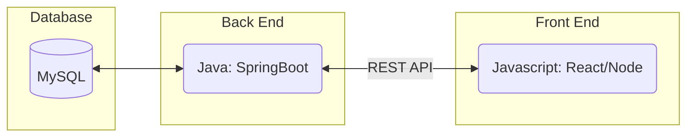
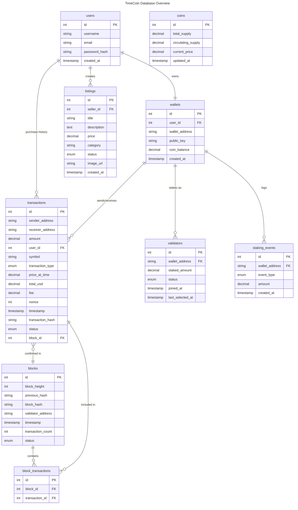
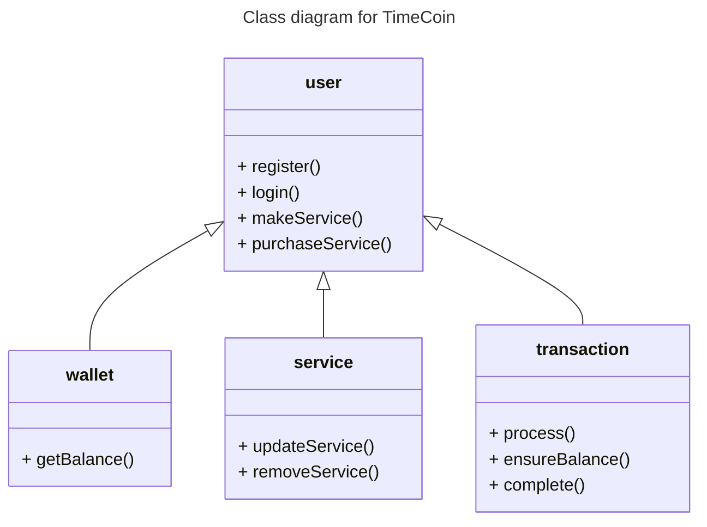
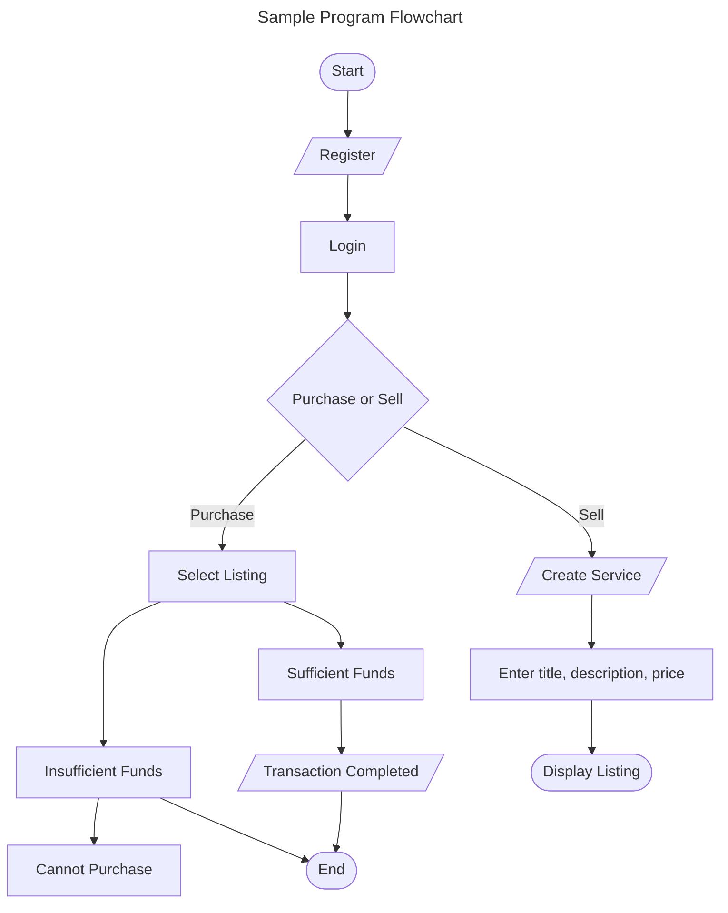
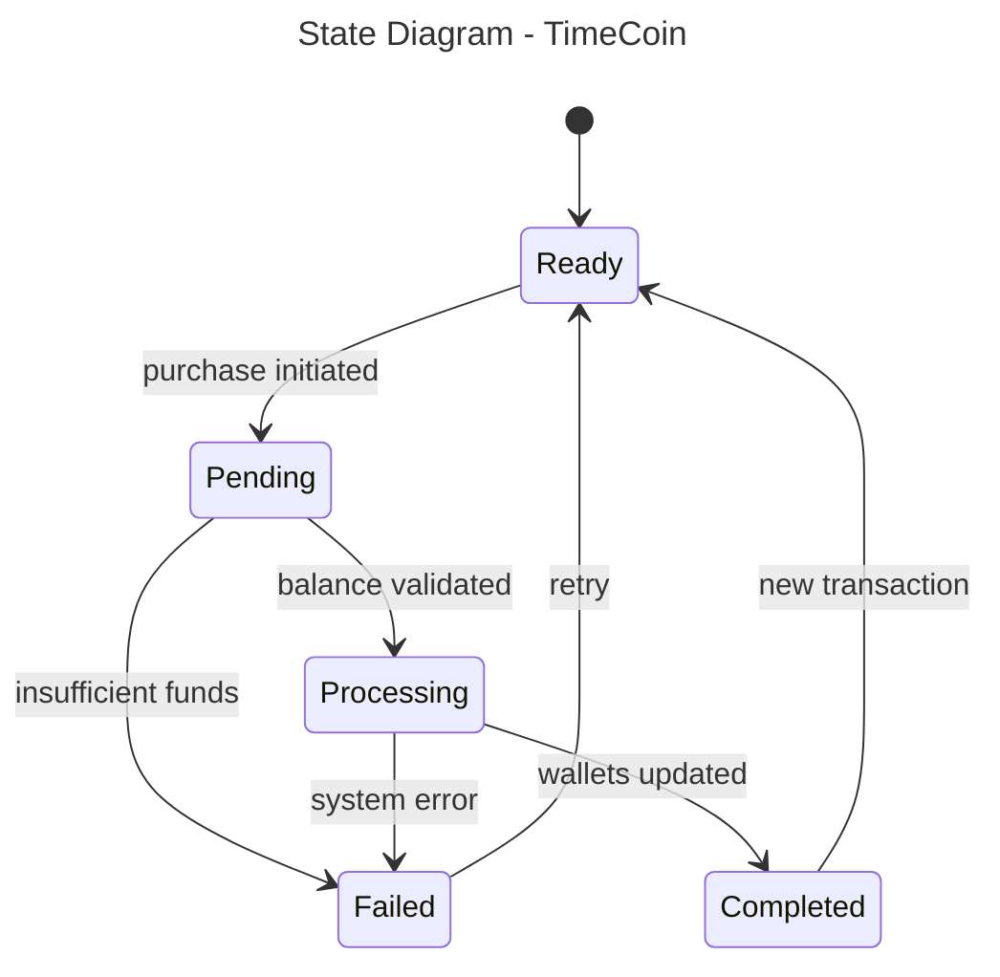
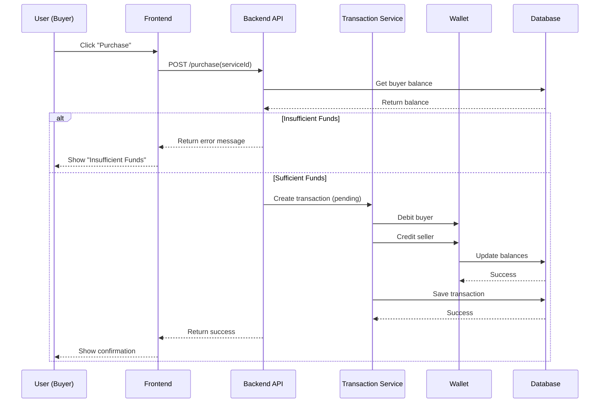

# Specification Document

Please fill out this document to reflect your team's project. This is a living document and will need to be updated regularly. You may also remove any section to its own document (e.g. a separate standards and conventions document), however you must keep the header and provide a link to that other document under the header.

Also, be sure to check out the Wiki for information on how to maintain your team's requirements.

## TeamName

**TimeCoin** (Project_12)

### Project Abstract

<!--A one paragraph summary of what the software will do.-->

*TimeCoin* is a time-based cryptocurrency platform designed for UW-Madison students to exchange services within their campus community. Students can register for an account, receive a TimeCoin wallet, and use the service marketplace to post or purchase offerings such as tutoring, coding help, or other skills. Transactions are recorded on a lightweight blockchain ledger; each transfer is hashed, grouped into blocks, and committed to the chain. The platform handles user authentication via JWT, peer-to-peer coin transfers between wallets, and a full marketplace purchase flow backed by balance validation and atomic transactions.

## Key Features of *TimeCoin*

- **Student Accounts**
  - Secure login & registration
  - Wallet with TimeCoin balance
  - Transaction history

- **Service Marketplace**
  - Post a service with description and price
  - Browse available services
  - Filter/search by category

- **Time-Based Currency**
  - Earn TimeCoins by providing services
  - Spend TimeCoins to receive services
  - Track all transfers transparently

- **Transaction System**
  - Peer-to-peer coin transfers
  - Service completion confirmation

- **Rating and Feedback**
  - Review service providers
  - Build trust on the platform

### Customer

The primary customers of *TimeCoin* are University of Wisconsin-Madison students who are wanting to exhange services within our campus community. Many students have valuable skills to share with others, but don't have a platform that can reliably outsource them. Likewise, there are many students who need academic accomodations who don't know where to find it outside of university offered sessions. 

By using time as the main unit of value in our system, we are effectively buying students more time. Making our platform beneficial for those who need academic support and don't have the time to make university help sessions, or students that have time on their hands and skills that are marketable.

### Specification

<!--A detailed specification of the system. UML, or other diagrams, such as finite automata, or other appropriate specification formalisms, are encouraged over natural language.-->

<!--Include sections, for example, illustrating the database architecture (with, for example, an ERD).-->

<!--Included below are some sample diagrams, including some example tech stack diagrams.-->

#### Technology Stack

| Layer | Technology |
|---|---|
| Frontend | React.js |
| Backend | Java 21 with Spring Boot 4.0.2 |
| Database | MySQL 8.0 (Dockerized) |
| Authentication | JWT via `jjwt` 0.13.0, BCrypt password hashing |
| Security | Spring Security |
| ORM | Hibernate / Spring Data JPA |
| Build Tool | Gradle |
| Testing | JUnit 5 + Mockito |

#### Database

#### Class Diagram

#### Flowchart

#### Behavior

#### Sequence Diagram

### Standards & Conventions

<!--This is a link to a seperate coding conventions document / style guide-->
[Style Guide & Conventions](STYLE.md)
